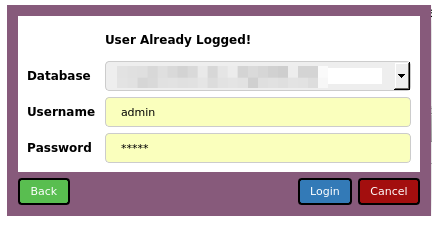

# Welcome On Odoo Qt Project

The project intend to get a fully qt ui version for odoo, providing form a search view to be used in non web environment, like Allocation extension.


[bitbucket](https://bitbucket.org/mboscolo/odoo_qt.git)


Here's an example of some Python code to show an odoo Login Form:




```python
import sys
from PySide import QtGui
from OdooQtUi.connector import MainConnector

app = QtGui.QApplication(sys.argv)
connectorObj = MainConnector()
connectorObj.loginWithDial()    # Perform show of the login form


app.exec_()

```

Here's an example of some Python code to show an odoo Form:


```python

import sys
from PySide import QtGui
from OdooQtUi.connector import MainConnector

app = QtGui.QApplication(sys.argv)
connectorObj = MainConnector()
connectorObj.loginWithDial()    # Perform show of the login form

tmplViewObj = connectorObj.initFormViewObj('product.template')
tmplViewObj.loadIds([10])   # Edit Form on product.teplate with id =10

dialog = QtGui.QDialog()
lay = QtGui.QVBoxLayout()
lay.addWidget(tmplViewObj)
dialog.setLayout(lay)
dialog.exec_()
app.exec_()

```


Here's an example of some Python code to show a odoo tree view:


```python
import sys
from PySide import QtGui
from OdooQtUi.connector import MainConnector

app = QtGui.QApplication(sys.argv)
connectorObj = MainConnector()
connectorObj.loginWithDial()    # Perform show of the login form

tmplViewObj = tryListView('product.template', viewFilter=True)

dialog = QtGui.QDialog()
lay = QtGui.QVBoxLayout()
lay.addWidget(tmplViewObj)
dialog.setLayout(lay)
dialog.exec_()
app.exec_()

```


Have fun!


[Github-flavored Markdown](https://guides.github.com/features/mastering-markdown/)
to write your content.
